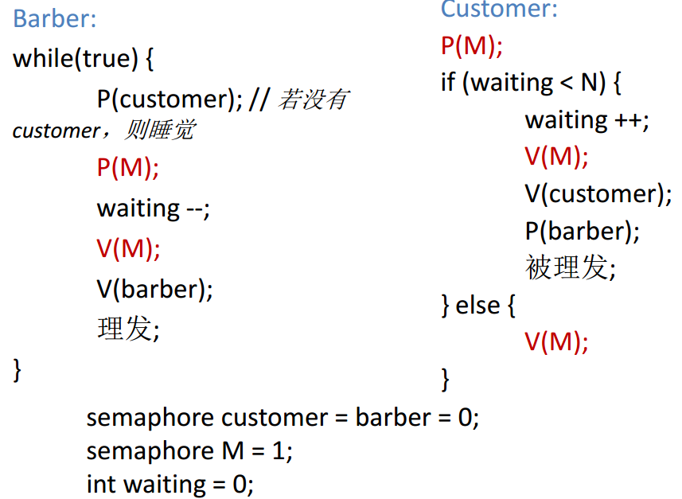
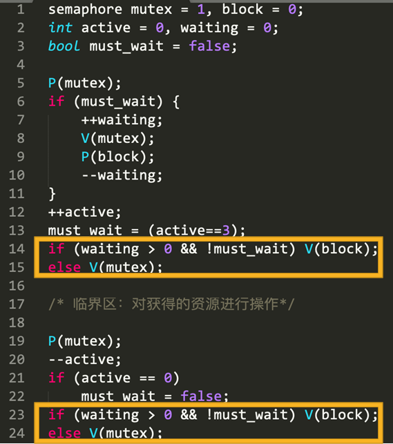

# Classical PV Operation Problem

[TOC]

资料见此[PV操作](@attachment/PV操作.pdf).


**设计思路**

- <u>思考谁什么时候等</u>, 设定信号量和变量

- 写出程序的框架

- 加互斥

  

## 设计信号量机制使得每个信号量的等待队列最多只有一个进程

### 漏斗法


### 二叉树法


## 睡眠理发师问题

> 理发店里有一位理发师，一把理发椅和N把供等候理发的顾客坐的椅子。如果没有顾客，则理发师便在理发椅上睡觉。当一个顾客到来时，他必须先唤醒理发师；如果顾客到来时
> 理发师正在理发，则如果有空椅子，可坐下来等；否则离开。  
>
> (单理发师, 没有椅子就离开)



> 理发店里有一位理发师，一把理发椅和N把供等候理发的顾客坐的椅子。如果没有顾客，则理发师便在理发椅上睡觉。当一个顾客到来时，他必须先唤醒理发师；如果顾客到来时理发师正在理发，则如果有空椅子，可坐下来等；否则等待椅子。  
>
> (单理发师, 没有椅子就等待)


## 生产消费者问题


###  变形: 复杂的消息缓冲问题

> 消息缓冲区为k个，有m个发送进程， n个接收进程， 每个接收进程对发送来的消息都必须取一次。  
>


## 读者写者问题

### 第一类读者写者问题（读者优先）

写者优先是指除非有写者在写文件，否则读者不需要等待，即当前在读， 目前有有写者在等待，新来一个写者，则新来的写者可以直接写.

 


### 第二类读者写者问题（写者优先）


### 第三类读者写者问题（读者和写者都不会饥饿）


## 船闸问题

>   由于水面高度不同，有160~175米的落差，所以三峡大坝有五级船闸， T1~T5。由上游驶来的船需经由各级船闸到下游；由下游驶来的船需经由各级船闸到上游。
> 假设只能允许单方向通行（此假设与实际情况不符，实际为双向各五级船闸）。  

类似于读者写者问题.


### 防止饥饿

  

### 单侧优先

为了让左边优先, 我们可以更改抢占锁的位置:


### 添加最大通信数量限制

>  双向通行的桥，桥只能单方向通行车，最多5辆车

加了最大通行数量的限制, 有两个思路, 一个是给由于多于5辆车的情况设置一个信号量, 另一个直接限制进入临界区的车的数量不超过5辆.

  

  

## 食品销售问题

>   某商店有两种食品A和B， 最大数量各为m个。该商店将A、 B两种食品搭配出售，每次各取一个。为避免食品变质，遵循先到食品先出售的原则。有两个食品公司分别不断地供应A、 B两种食品(每次一个)。为保证正常销售，当某种食品的数量比另一种的数量超过k(k<m)个时，暂停对数量大的食品进货。  


## 哲学家就餐问题

下面是使用管程解决哲学家就餐问题:

```pascal
monitor dining_controller:

cond forkready[n];
bool forks[n]={true};

void get_forks(int pid){
	int left = pid;
	int right = (pid + 1) % n;
	if(!fork[left])
		cwait(forkReady[left]);
	fork[left] = false;
	if(!fork[right])
		cwait(forkReady[right]);
	fork[right] = false;
}

void release_forks(int pid){
	int left = pid;
	int right = (pid + 1) % n;
	
	if(empty(forkReady[left]))
		fork[left] = ture;
	else
		csignal(forkReady[left]);
		
	if(empty(forkReady[right]))
		fork[right] = true;
	else
		csignal(forkReady[right]);
}
```

使用信号量解决, 关键思想是设置一个中间状态表示"举手"申请资源.

```c
#define THINKING 0
#define HUNGRY 1
#define EATING 2

int state[n]={THINKING};
semaphore mutex;
semaphore person[n]={0};

void test(int pid){
    int left = pid;
    int right = (pid + 1) % n;
    if(state[pid]==HUNGRY && state[left]!=EATING && state[right]!=EATING){
        state[pid] = EATING;
        V(person[pid]);
    }
}

void get_fork(int pid){
    P(mutex);
    state[pid] = HUNGRY;
    test(pid);
    V(mutex);
    P(person[pid]);
}

void release_fork(int pid){
    int left = pid;
    int right = (pid + 1) % n;
    
    P(mutex);
    state[pid] = THINKING;
    test(lest);
    test(right);
    V(mutex);
    
}
```

## 共享资源管理

> 考虑具有如下特征的共享资源：
>
> • 当使用该资源的进程小于3个时，新申请资源的进程可以立刻获得资源； 
>
> • 当三个资源都被占用后，只有当前使用资源的三个进程都释放资源后，其他申请资源的进程才能够获得资源。

第一种解法会设置一个must_wait变量, 这个变量会有等待的进程和最后一个离开的进程设置.

  

第二种解法是接力棒传递模式(pass the baton). 接力棒是信号量block, 在接力棒没有传完之前(`waiting>0 && !must_wait`), 互斥锁`mutex`不会释放.

   

​		
