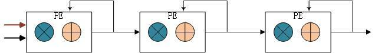

# Deep Learning Accelerator

[FPGA架构模块] 片上缓存 卷积加速模块 pool模块 load save 指令控制模块

[关注性能] 算力 网络模型大小 网络精度

- 网络压缩算法很多, 但是相比于算力和模型大小, 精度较少被关注)

[软件编译的困难]

- 不同的网络模型: 网络模型多样&开源网络模型平台也很多(tensorflow, pytorch等)
- FPGA硬件的变化:各个模块的可配参数的变化(比如卷积模块并行数的变化)

[不同DNN模型的部署]

LSTM中主要包含矩阵乘法，向量求和，激活操作，向量点乘等。矩阵乘法消耗最多的运算资源，如何优化这种运算是FPGA实现加速的关键.

对于矩阵乘法, 其乘法顺序有几种方式, 根据roofline模型, 我们需要着重考虑<u>计算访存比</u>.

1. 小矩阵 x 小矩阵

   A每次获得nxm块数据，和B的mxv块数据相乘，然后A移动nxm块，B向下移动mxv块，再次相乘并且和之前结果累加，当A移动到右端，B同时移动到底端，完成C中nxv矩阵块.

   对A来说, 计算访存比为v. A可以看做权重，B看做输入，如果输入"宽度不够"，那么计算访存比较低.

   

2. 列向量 x 行向量

A每次获得nx1列向量，B获得1xn行向量，二者进行叉乘，得到nxn个矩阵数据，然后A向右移动，同时B向下移动，二者叉乘结果和上一次进行累加，最后当A移动到右端，B到底端，得到了一个nxn大小的C矩阵块。

对A来说, 计算访存比是n. A仅仅需要n个数，就能参与n*n次乘法, 这能够很大缓解带宽瓶颈。但是如果B的宽度较小或者B为向量，那么就会造成计算访存比较低，如何选择需要根据实际情况来决定.

[量化和减少权重]

量化: 定点化, 二值化, log量化.

减少权重: 减枝, 结构化参数

[CNN中并行的方法]

CNN中可以进行并行化运算的结构有：输入通道，输出通道，图像卷积. 这其中输出通道之间是没有依赖关系的，而输入通道的结果是需要求和的.

输入通道之间需要求和运算，所以使用了加法树. 在进行FPGA设计的时候这是一个需要考虑的问题，输入通道越多，加法树的fan-in越大，那么在高速时钟情况下，不同路径时间的延时就会影响时序性能了.

如果输出通道变大，那么feature map数据的fan-out就会变大，因为同一个feature map是被所有输出通道共享的.

因此输入输出通道的并行数收到了网络层大小以及fan-in和fan-out的限制，不可能太大. 。有没有什么方法可以降低fan-in和fan-out呢？如果将输入通道的求和也使用累加来实现，那就变成只有一个PE完成卷积运算以及不同通道的求和。但是一个PE却降低了并行度，那么可以想到增加串行的PE数量来增加输入并行度，即演变为一列PE来实现输入通道求和。由于PE排序上的空间限制，导致后边一个PE的计算相比于前一个PE要有1个周期延时，如果将数据从从PE间的移动打一拍，那正好可以在第二个PE计算出来的同时完成和前一个PE的求和，这就是脉动的关键所在.

增加并行度还需要继续探索图像卷积, 首先我们想到卷积不是多个像素和卷积核进行乘法嘛，那么我们也将这些乘法并行起来就可以啦。但是这样存在一个问题就是：卷积核大小是不固定的，比如3x3卷积核中9个乘法被同时执行，那么等到了1x1卷积核，就会只有1个乘法器被使用，降低了乘法器利用率.

并行运算最好找到不存在依赖关系的运算。每行像素的输出是并行的，没有依赖关系的。那么就可以同时进行多行的卷积运算，而一个卷积核内的乘法和加法就可以用一个乘法器和累加器来做，这样就能适应不同卷积核大小的运算.

[存储结构]

考虑roofline模型, 横坐标是<u>计算访存比</u>, 纵坐标是实际算力.

一般来说, 在一个CNN中，网络越往后图像大小越小，输入输出通道数量变大，这导致的结果就是计算访存比变低，这个时候FPGA计算资源利用率就会下降.

分析<u>资源利用率</u>的公式. 容易知道数据量D和计算访存比I同总计算量W的关系如下, 其中D为数据量，I为计算访存比:

$$
W = DI
$$
那么资源利用率可如下表示. 其中$\pi$ 是最大算力.

$$
\eta=\frac{\frac{W}{\pi}}{\frac{D-M}{B}+\frac{W}{\pi}}=\frac{1}{\frac{(1-M / D) \pi}{B I}+1}
$$

[指令]

指令实际上是一些控制FPGA流程的信息，比如载入多少数据，进行哪些运算（conv，pool等）。这些控制信息会根据不同的网络结构编辑好，存储成二进制文件放到ddr中。通过FPGA读入来控制操作。这些指令大体上包括以下几种：

1. load weights/image：从ddr中加载权重或者image数据到片上来。这其中会包含ddr首地址，需要读入的数据长度等信息。

2. conv：这个主要进行卷积运算，包括卷积核大小，图像大小，输入输出通道等信息。

3. activate：激活函数的控制，控制是否进行激活操作。

4. save image：将运算完的结果存储到ddr中，包括ddr地址，长度等信息。

硬件整体框架基本包括三部分：fetch，execute，result

Fetch包含一个简单的DMA引擎，以及一个数据读取调度器，主要用于从DDR中获得指令和数据. 数据被放于片上缓存中，片上缓存和计算单元通过大量走线互联，走线的带宽受到了DDR带宽的限制，而走线带宽取决于计算单元的算力。论文中参数化了这三个变量，可以根据不同平台来进行适配.

Execute是最核心的计算单元，这部分由基本的DPU构成。DPU是专门处理数据乘法和累加的单元，这些DPU相互连接成二维平面结构，专门用于处理矩阵乘法。DPU结构主要由一个与门，求和，移位寄存器，累加器组成。与门和求和结构用于计算1bit矩阵乘法，移位寄存器用于乘以权重系数，累加器是用于大矩阵求和。

一个大矩阵乘法是被分块的，然后每块乘法是用矩阵列x行的形式，这样计算阵列中的每行和每列对应的buffer中的数据都是被多次利用的，并且以广播形式传播到各个单元。这种方式增加了矩阵数据利用率，能够到达缓解搬运带宽。

Result结构和fetch类似，只不过是写入DDR。也是通过DMA引擎来控制对DDR写入。

指令也是依据三种结构来设计成对应指令：fetch，execute，result。创新点主要在指令的pipeline设计上。其通过引入“锁”的机制来实现不同指令之间的依赖关系。用wait来阻塞下一条指令的执行，而用signal来接触wait，触发下一条指令执行。三种指令主要是fetch和result相对于execute的依赖。如果fetch完成，execute可以执行，在执行的同时，fetch可以读取下一次要用的数据，通过这样的流水来减少execute的等待时间。

### Paper Script

| Paper Title                                                  | Tag                                 | Abstract & Contribution                                      | Memo                                 |
| ------------------------------------------------------------ | ----------------------------------- | ------------------------------------------------------------ | ------------------------------------------------------------ |
| [BISMO: A Scalable Bit-Serial Matrix Multiplication Overlay for Reconfigurable Computing](), FPL 2018 | `SpMM` | 可变位宽的大规模矩阵乘法方法, 主要利用了二进制               |                                                              |
| [Efficient and Effective Sparse LSTM on FPGA with Bank-Balanced Sparsity](), FPGA 2019 [Balanced Sparsity for Efficient DNN Inference on GPU.](), AAAI 2019 |                                     | 处理的问题是神经网络<u>剪枝和量化</u>后的权重数据大大减少, 但是权重分布随机由于木桶效应导致计算效率不高. 这里通过bank-balanced的方式进行每一行的负载均衡, 一行分成若干个bank, bank内部进行细粒度的剪枝. | https://www.msra.cn/zh-cn/news/features/weight-sparsity-feature-map-sparsity |
| [SeerNet: Predicting Convolutional Neural Network Feature-Map Sparsity through Low-Bit Quantization](), CVPR 2019 | | 这篇论文关注的是卷积神经网络中输出特征图的稀疏性。例如，在卷积神经网络中，每个卷积层后通常会连接ReLU层或者Max-pooling层。经过ReLU或Max-pooling层后，卷积层的大部分输出被置为零或丢弃。从计算的角度考虑，如果能够省略零值输出和丢弃输出所对应的先导卷积计算，则可以大大减少卷积层的计算量. | https://www.msra.cn/zh-cn/news/features/weight-sparsity-feature-map-sparsity |
|  | |  |  |
| [Speeding up convolutional neural networks using fine-tuned CP-decomposition](), ICLR 2015 |                                     | 通过CP分解将一个四维张量分解成多个低维度的张量，并且最后通过微调参数来提升网络精度 |  |
| [OuterSPACE: An Outer Product Based Sparse Matrix Multiplication Accelerator](), HPCA 2018 | `SpMM` | 利用外积计算矩阵乘法, 由于外积形式天然对CSC形式友好 |  |
| [Tensaurus: A Versatile Accelerator for Mixed Sparse-Dense Tensor Computations](), HPCA 2020 | `SpMM` `GEMM` |  |  |
| [SMASH: Co-designing Software Compression and Hardware-Accelerated Indexing for Efficient Sparse Matrix Operations](), MICRO 2019 | `SpMM` | 下标查找是CSR等压缩形式的bottleneck leverage a *hierarchy of bitmaps*进行编码 |  |
| [MAERI: Enabling Flexible Dataflow Mapping over DNN Accelerators via Reconfigurable Interconnects](), ASPLOS 2018 | |  |  |
| [Bit Fusion: Bit-Level Dynamically Composable Architecture for Accelerating Deep Neural Networks](), ISCA 2018 | |  |  |
|  | |  |  |

##### 可变位宽的大规模矩阵乘法方法

- [BISMO: A Scalable Bit-Serial Matrix Multiplication Overlay for Reconfigurable Computing](), FPL 2018

本文介绍了一种数据位宽可变的乘法方法，由于避免了DSP的使用，可以充分利用LUT资源，在DSP数量少的芯片上也可以获得很高的计算量。这种方法更适合大矩阵乘法，矩阵越大，计算效率就会越高.

方法其实很简单，就是利用数据的二进制表示方法, 这样就将矩阵中每个数都分解成1bit数和一个权重数相乘的形式，而这个权重是2的幂次，在FPGA中可以通过简单移位操作来实现。

但是这样做也有一个缺点，就是延迟变大了。所以对于特大矩阵乘法来说，这些延迟可以通过增加计算量来弥补。将这种方法进行推广，可以想到用4进制，8进制来进行数据表示，这样对于较大位宽数据来说可以降低延时。但是这样的低价就是增加了LUT资源。比如对于4进制表示，乘法数据为2bit，这个就会需要更多LUT来完成了。如果表示进制更高，比如16进制，那么用乘法器实现就更合适了。

##### bank-balanced Sparsity(BBS)

-  [Efficient and Effective Sparse LSTM on FPGA with Bank-Balanced Sparsity](), FPGA 2019
- https://www.msra.cn/zh-cn/news/features/weight-sparsity-feature-map-sparsity

处理的问题是神经网络<u>剪枝和量化</u>后的权重数据大大减少, 但是权重分布随机由于木桶效应导致计算效率不高.

稀疏数据需要进行稀疏编码.

##### CP分解

- [Speeding up convolutional neural networks using fine-tuned CP-decomposition](), 2015

- https://zhuanlan.zhihu.com/p/83455440
通过CP分解将一个四维张量分解成多个低维度的张量，并且最后通过微调参数来提升网络精度

二维矩阵分解即SVD, 当维数高于2维的时候用非线性最下平方差(non-linear least squares)的方法.

## Repository

### mobile

- [ncnn](https://github.com/Tencent/ncnn): a high-performance neural network inference framework optimized for the mobile platform

### DSL

- [SCALE-Sim](https://github.com/ARM-software/SCALE-Sim):  provides cycle-accurate timing, power/energy, memory bandwidth and trace results for a specified accelerator configuration and neural network architecture.
