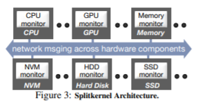
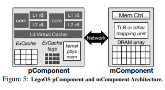
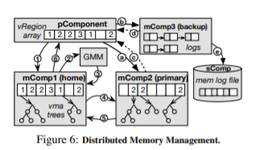

# Disaggregated System Lecture Script

*<u>`LegoOS`: A Disseminated, Distributed OS for Hardware Resource Disaggregation</u>*

[lecturer] Yiying Zhang, UCSB

> What are the disadvantages of monolithic server?

- low resource utilization
- poor hardware resilience
- low disaster tolerance
- poor support for hardware diversity

> Why we propose SplitKernel architecture?

- challenge: hardware diversity(GPU, TPU, DPU, FPGA, NVM)
- opportunity: the increase of network transmission rate(RDMA, new switch technology, InfiniBand…) makes the bandwidth gap with the memory bus within a order of magnitude.

[System Design]

*<u>vNode Server</u>* is exposed to users and is seen as a complete machine. A vNode Server consists of multiple pComponent, mComponent and sComponent, which are connected by network.

**<u>*pComponent*</u>**: It will mainly focus on the process/thread scheduling, system calls and other functions. LegoOS is compatible with the Linux ABI interface. The user's program will only run in the user space of pComponent. Cache (L1, L2, L3, ExCache) will be left on pComponent. In order to reduce the overhead of network access memory, a layer of ExCache with a size of 4G will be left in pComponent. If ExCache is missed, it will access mComponent. ExCache Provide FIFO or LRU control strategy.

**<u>*mComponent*</u>**: in charge of memory allocation, virtual address mapping(TLB, Page Table). However, cache is located in pComponent, and we add one more Cache Layer <u>*ExCache*</u> in pComponment.

Its data types are mainly composed of three types: 

- anonymous memory such as heap and stack.

-  memory-mapped file

- storage buffer cache. 

<u>*Memory Management*</u>. *<u>mMonitor</u>* is responsible for memory address mapping conversion, allocation, release, read and write. For example, in traditional operating system page cache, TLB will be placed in mComponent. 

<u>*Disaster Tolerance*</u>. At the same time, in order to handle the failure situation, the same memory area will have a master-slave to provide high reliability. Memory write operations will be sent to the master-slave mComponent at the same time.

<u>*Memory Log File*</u>. The mComponent will persist the log file of the memory to the sComponent.

***<u>sComponent</u>***:

<u>*IO system*</u>. The main IO system will be implemented in sComponent. However, the storage buffer cache will be placed in mComponent, for sComponent's own memory is very small.

<u>*Compatibility*</u>. It is compatible with the POSIX interface. Any hardware complying with POSIX standard could be easily added.

***<u>Global Resource Management*</u>**: Global resource management corresponds to three GPM, GMM, and GSM. They mainly do coarse-grained resource allocation and load balancing.

