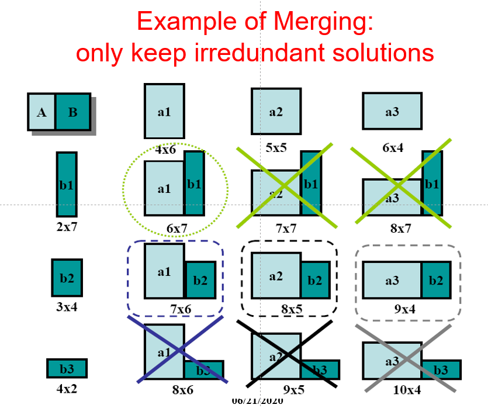

# Floorplan

[TOC]

## Problem Statement & Object Function

  

  

- Exact wirelength of each net is not known until routing is done.
- In floorplanning, even pin positions are not known yet.
- Some possible wirelength estimations
  - Center-to-center estimation
  - Half-perimeter estimation

  

<u>Dead Space</u>: the space that is wasted

Slicing Floorplan & Non-Slicing Floorplan

|                           | Remark                                                       | Illustration                                                 |
| ------------------------- | ------------------------------------------------------------ | ------------------------------------------------------------ |
| Slicing Floorplan(easier) | One that can be obtained by repetitively subdividing (slicing) rectangles horizontally or vertically. |    |
| Non-Slicing Floorplan     | One that may not be obtained by repetitively subdividing alone. |    |

## Polar Graph Representation

*Note: There are many other graph representations.*

- Each floorplan is modeled by a pair of directed acyclic graphs: Horizontal polar graph && Vertical polar graph

- For horizontal (vertical) polar graph
  - Vertex: Vertical (horizontal) channel
  - Edge: 2 channels are on 2 sides of a block
  - Edge weight: Width (height) of the block

  

  

## Normalized Polish Expression: Representation of Slicing Floorplan

- <u>Skewed Slicing Tree</u>
  - no node and its right son are the same.

- <u>Normalized Polish Expression</u>
  - no consecutive H’s or V’s in polish expression
  - what is a valid NPE?
    - operand: +1; operator -1; any prefix sum is greater or equal to zero.
  - Normalized polished expression can be formulated as a state space search problem.
- There is a 1-1 correspondence between Slicing Floorplan, Skewed Slicing Tree, and Normalized Polish Expression.

  

#### Neighborhood Structure

  

  

### Combining Shape Curves

  

  

### One Algorithm: Annealing Schedule

  

## How to handle L-shaped blocks?

  

Differences

- Another 5 operators and 4 moves defined to handle the more complex shapes

  - ~, V1, V2, H1, H2

- Idea of shape curves no longer applicable

- Depend on Simulated Annealing to pick different shapes for blocks probabilistically

  

  

  

  

### Dynamic Programming

  

## Mixed Integer Linear Program

### Formulation with Hard Blocks

  

### Formulation with Soft Blocks

  

  

## Successive Augmentation

  

## Sequence-Pair Representation: General(non-slicing) floorplans representations

- Positive Locus
  - center of each block -> move right -> move up -> …
  - center of each block -> move left -> move down -> …
- Negative Locus
  - center of each block -> move down -> move right -> …
  - center of each block -> move up -> move left -> …

  

  

  

  

- Given a sequence-pair, the placement with smallest area can be found in $O(n^2)$ time.
- Algorithms of time $O(n\log \log n)$ or $O(n \log n)$ exist. But faster than $O(n^2)$ algorithm only when $n$ is quite large.

### Floorplan Realization

> How to construct a floorplan from a sequence pair?

We can make use of the horizontal and vertical constraint graphs ($G_h$ and $G_v$).

  

  

  

  

  