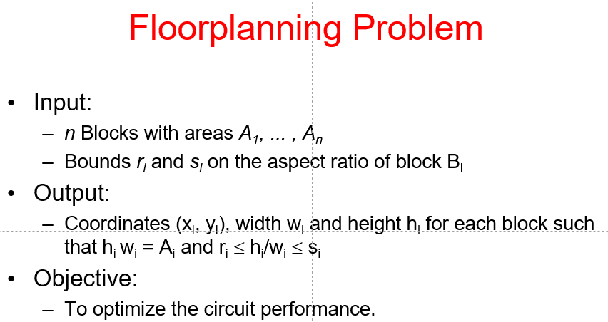

# Floorplan

[TOC]

## Problem Statement & Object Function

  

  

- Exact wirelength of each net is not known until routing is done.
- In floorplanning, even pin positions are not known yet.
- Some possible wirelength estimations
  - Center-to-center estimation
  - Half-perimeter estimation

  

<u>Dead Space</u>: the space that is wasted

Slicing Floorplan & Non-Slicing Floorplan

|                           | Remark                                                       | Illustration                                                 |
| ------------------------- | ------------------------------------------------------------ | ------------------------------------------------------------ |
| Slicing Floorplan(easier) | One that can be obtained by repetitively subdividing (slicing) rectangles horizontally or vertically. |    |
| Non-Slicing Floorplan     | One that may not be obtained by repetitively subdividing alone. |    |

## Polar Graph Representation

*Note: There are many other graph representations.*

- Each floorplan is modeled by a pair of directed acyclic graphs: Horizontal polar graph && Vertical polar graph

- For horizontal (vertical) polar graph
  - Vertex: Vertical (horizontal) channel
  - Edge: 2 channels are on 2 sides of a block
  - Edge weight: Width (height) of the block