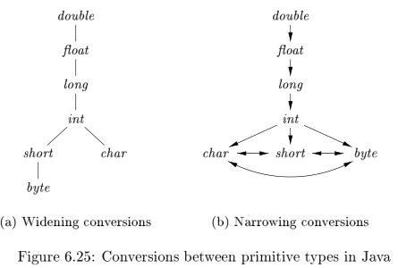

# Intermediate Representation

[TOC]

## Format

representation method:

- AST

- DAG

  

  

  differences DAG between AST: before creating a new code, these functions first check whether an identical node already exists.00

- three-address code

  ```
  x = y op z
  x = op y
  x = y
  goto L
  if/ifFalse x goto L
  if x ROP y goto L
  
  param x1; param x2; ... param xn; y = call p n // return y
  x=y[i]
  x[i]=y
  x=&y
  x=*y
  *x=y
  ```

| implementation of three-address code |                                    |
| ------------------------------------ | ---------------------------------- |
| quadruple                            | `op arg1 arg2 result`              |
| triple                               | `op arg1 arg2`                     |
| indirect triple                      | indirect code table + triple table |

### quadruple

`op arg1 arg2 result`


### triple

`op arg1 arg2`


### indirect triples

Problem of triples: moving an instruction may require us to change all references to that result

solution: <u>**indirect triples**</u>


## SSA(Static Single Assignment)

based on triples

all assignments in SSA are to variables with distinct names


the same variable may be defined in two different control-flow paths in a program.


 ø-function to combine the two definitions of x: 


## Type Expression

```
type_exp ::= 
basic_type    
type_name    
array(size, type_exp)    
record(fields) 
function s-> t    
s X t  (tuple) 
```


Type expression may contain variables whose values are type expressions.

#### type equivalence

- structurally equivalent(iff. one of the following conditions is true):
  - they are the same basic type
  - they are formed by applying the same constructor to structurally equivalent types
  - one is a type name that denotes the other
- name equivalence
  -  two types are equal if, and only if, they have the same name


### type system & type conversion 

- type system = type expression + type conversion rules

- 隐式转换(coercion)
- 显式转换(cast)

widening & narrowing




### Declarations


### Storage Layout of local variables


Note: t & w are global variables.

### sequence of declarations


### Fields in Records and Classes


