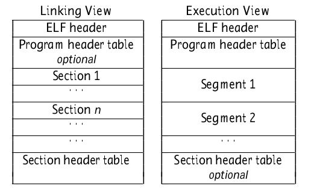

# Learning ELF in X minutes

## Resources

- https://wongsingfo.github.io/comp-sys/docs/linking/elf/

> program, section & segment

program table: optional in linking view

section table: optional in execution view



```bash
objdump 
# -f : file header(including start address)
# -h : section headers
# -d : Display assembler contents of executable sections
# -D : Display assembler contents of all sections
# -S : Intermix source code with disassembly
# -g : Display debug information in object file
# -j [section name]: display specified section
# -t: Display the contents of the symbol table(s)
# -r: Display the relocation entries in the file
# -R: dynamic relocation entries, only meaningful for dynamic objects

readelf
# -h : file header
# -l --segments: program headers(focus on loading into memory iamge)
# -S --sections: sections headers(focus on various section with different functions)
# -e : Equivalent to: -h -l -S
# -s --syms : symbol table
# --dyn-syms : dynamic symbol table
# -x [section name]: hex dump of specified section


addr2line -a [address] -e [filename] -f
# translates addresses into file names and line numbers
```
