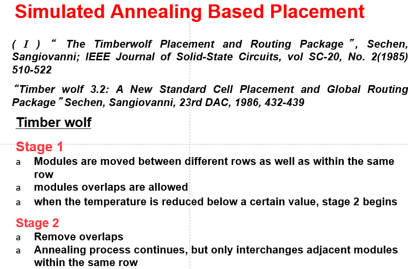

# Placement

  

## Simulated Annealing Method

### Case Study: Timber Wolf

  

- two-stage simulated annealing
- move of a module within a range limiter
  - replace
  - interchange
  - orientations
  - …

#### Stage #1 cost Functions

[component]

- balance between width & height $C_1=\alpha_iw_i+\beta_ih_i$

- penalty function for module overlaps in the X-dimension
  $$
  C_{2}=\sum_{i \neq j}(O(i, j)+\alpha)^{2}
  $$
  
- penalty function that controls the row lengths

  - d(r): desired row length

$$
C_{3}=\sum_{r} \beta|l(r)-d(r)|
$$

### Case Study: Dragon2000

- simulated annealing based
- top-down hierarchical approach
  - **hMetis** to recursively quadrisect into $4^h$ bins at level $h$
  - swapping of bins at each level by simulated annealing(SA) to minimize wirelength
  - terminates when each bin contains <7 cells
  - then swap single cells locally to further minimize wirelength

## Partition-based Methods

Recall partition algorithm …

- Fiduccia-Mattheyses(FM) Algorithm

- Multilevel techniques, e.g., **hMetis**

- …

Two academic open source placement tools

- Capo (UCLA/UCSD/Michigan): multilevel FM

- Feng-shui (SUNY Binghamton): use hMetis

There are many variations in the partitioning-based approach. They are different in

- the objective function used
- the partitioning algorithm used
- the selection of cut-lines

### Case Study: Terminal Propagation

## Analysis Method

