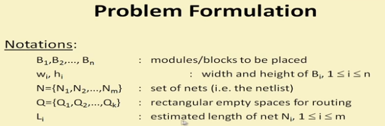

# Placement

## Resource

- https://www.youtube.com/watch?v=5SD7QfTQs1g

## Overview

### Problem Formulation

  

### Wirelength Estimation

The actual wiring paths are not known during placement.

- For two-terminal nets, we use Manhattan distance
- For multi-terminal nets
  - complete graph
  - minimum spanning tree
    - cons: branching allowed only at pin locations
  - rectangular Steiner tree
    - the shortest route for connecting a set of pins
    - branching allowed from any pointing along its length
    - cons: problem of find Steiner tree is NP-complete
  - semi perimeter
    - find the smallest bounding rectangle that encloses all the pins in the net
    - efficient and **most widely used**

>  *Note: The main issue in placement can differ depending on the design style used(standard cell-based design, full custom, ASIC and gate array).*
>
>  - For standard cell-based design style, the floor-planning the placement problems are the same(recall that in stand-cell design all cells must be placed in rows).
>    - minimization of the layout areas means
>      - minimize sum of channel heights
>      - minimize width of the width of the widest row(all rows should have equal width)
>    - Over-the-cell routing(new technology) leads to almost *channel-less* standard cell designs
>  - For full custom design style
>     - placing a number of blocks of various shapes and sizes within a rectangular region
>     - irregularity of block shapes may lead to unused areas
>     - both floor-planning and placement steps are required
>     - may require iterations
>  - For gate arrays
>    - The problem of partitioning, floor-planning and placement are the same in the design style
>    - For FPGAs, the partitioned sub-circuit may be a complex netlist, namely mapping the netlist t one or more basic blocks or LUTs.
>
>  We will discuss the main issues relating to the ASIC design styles.

###  Classification of  Placement Algorithms

  

## Placement Algorithm: Simulated Annealing

### Case Study: Timber Wolf

  

#### SCHEDULE(T)

  

#### the PERTURB Function

  

##### Move Restriction

move range: global -> local

  

#### Cost Function

Add items of penalty for overlapping to avoid overlapping

  

### Case Study: Dragon2000

- simulated annealing based
- top-down hierarchical approach
  - **hMetis** to recursively quadrisect into $4^h$ bins at level $h$
  - swapping of bins at each level by simulated annealing(SA) to minimize wirelength
  - terminates when each bin contains <7 cells
  - then swap single cells locally to further minimize wirelength

## Placement Algorithm: Force Directed Placement

The blocks connected to each other by nets are supposed to exert attractive forces on each other

- One solution is that the spring constant is proportional to the  quantity of  wires in a net
- Magnitude of this force is directly proportional to the distance between the blocks

## Placement Algorithm: Partition-based Methods

Recall partition algorithm …

- Fiduccia-Mattheyses(FM) Algorithm

- Multilevel techniques, e.g., **hMetis**

- …

[Two academic open source placement tools]

- Capo (UCLA/UCSD/Michigan): multilevel FM
- Feng-shui (SUNY Binghamton): use hMetis

### Quadrature Min-cut Placement

 The division(horizontal->vertical->horizontal-> …) is recursively applied to the quarters in the same rows/columns.

  

### Recursive Bi-partitioning Min-cut Placement

 The division(horizontal->vertical->horizontal-> …) is recursively applied to each quarter of the layout.

  

### Terminal Propagation Algorithm

When a net connecting two terminals is cut, a dummy terminal is propagated to the nearest pin on the boundary.

  

## Placement Algorithm: Cluster Growth

Blocks are placed sequentially in a partially completed layout.

## Placement Algorithm: Performance Driven Placement

*The delay* at chip level plays an important role in determining the performance of the chip.

There are two categories of this kind of algorithm:

- <u>Net-based Approach</u>. Try to route the nets to meet the timing constraints on the *individual* nets. Usually a pre-timing analysis generates the bounds on the net-lengths which must be satisfied during placement.
- <u>Path-based Approach</u>. Try to place the blocks in a manner that the path length is within the timing constraint.