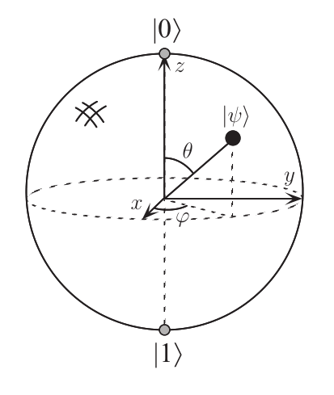

# Quantum Computing Primer

[TOC]

## Foundation of Quantum Computing

### Qubit Representation

单个<u>量子比特(qubit)</u>的状态可以在复数域$$\mathbb{C}$$上二维*希尔伯特空间(Hilbert space)*中表示, 不妨用狄拉克符号$$\vert\psi\rangle$$表示, 该符号称为*右矢(ket)*. 

希尔伯特空间是一个完备的内积空间, 由内积引申可以得到正交, 模长, 角度等概念. 在这个复数域$$\mathbb{C}$$上二维希尔伯特空间中总可以选择两个完备的正交归一基, $$\vert0\rangle$$ 和 $$\vert1\rangle$$ 线性表出任意一个向量$$\vert\psi \rangle$$, 即$$\exists!  \alpha, \beta \in \mathbb{C}, st. \vert\psi \rangle = \alpha \vert0 \rangle + \beta \vert1\rangle$$. 
在该组基底下, 任意矢量$$\vert\psi \rangle $$和两个基底$$\vert0\rangle$$ 和 $$\vert1\rangle$$ 用矩阵的方式表示为:

$$
|\psi\rangle = \left(\begin{array}{c}
\alpha\\
\beta \\
\end{array}\right)
,
|0\rangle = \left(\begin{array}{c}
1\\
0 \\
\end{array}\right)
,
|1\rangle = \left(\begin{array}{c}
0\\
1 \\
\end{array}\right)
$$

由于定义在复数域$$\mathbb{C}$$上, 我们很方便地可以定义一个右矢$$\vert \psi \rangle$$的共轭转置, 记为$$\langle \psi \vert $$, 即$$\langle \psi \vert = {\vert \psi \rangle}^{\dagger}$$. 在矩阵上表示为

$$
|\psi\rangle = \left(\begin{array}{c}
\alpha\\
\beta \\
\end{array}\right)
,
\langle\psi|=\left(\alpha^{*},  \beta^{*}\right)
$$

该符号被称为*左矢(bar)*, 是因为这样可以非常美观地表示内积, 如内积$$\vert\psi \rangle \cdot \vert \phi \rangle$$可以写成$$\langle \psi \vert \phi \rangle$$. 当然, 自身与自身的内积可以得到模长$$\langle \psi \vert \psi \rangle = \vert\alpha\vert^2 + \vert\beta\vert^2 \geq 0$$.

在量子计算中, 但是我们并不关心*全局相位*的大小, 即 $$\vert\psi \rangle$$和 $$t\vert\psi \rangle (t \in \mathbb{C})$$被认为是一样的. 因此我们统一归一化规定

$$
|\alpha|^2 + |\beta|^2=1
$$

上面的形式很容易想到进行三角化, 为了后面的形象化表示, 我们总可以通过改变全局相位的方式使得第一个分量$$\alpha$$变成实数. 故在不关心全局相位的情况下, $$\vert \psi \rangle$$可以被表示成:

$$
|\psi\rangle = \cos{\frac{\theta}{2}}|0\rangle + e^{i\phi}\sin{\frac{\theta}{2}} |1\rangle=
\left(\begin{array}{c}
\cos{\frac{\theta}{2}}\\
e^{i\phi}\sin{\frac{\theta}{2}}\\
\end{array}\right)
$$

之所以是这样表示, 是因为我们可以引入*Bloch球*表示量子比特, 而此时$$\theta$$和$$\phi$$在Bloch球有类似于极坐标的直观意义, 我们也可以看到此时 $$\vert0\rangle$$ 和 $$\vert1\rangle$$在Bloch球上的位置.

> 由于Bloch球只是一个直观意义, 有几个误区要指出:
>
> - 毕竟是希尔伯特空间而不是欧几里得空间, 所以不存在$$\vert0\rangle + \vert1\rangle =0$$这种说法, 实际上$$\frac{\vert0\rangle \pm \vert1\rangle}{2}$$分别是x轴正负半轴与球面的交点, 这两个状态在后面介绍Hadamard门时会出现.
> - 但是后面介绍的少部分量子门可以在bloch球上得到直观解释, 如Hadamard门相当于绕x轴与z轴的角平分线逆时针旋转180度(相当于x,z轴交换位置, y正半轴变成指向原本y负半轴的方向)
> - 映射到Bloch球面的时候需要第一个分量为实数, 如$$\frac{1}{2}\left(\begin{array}{c}1+i\\ 1-i \\ \end{array}\right)$$和$$\frac{1}{\sqrt{2}}\left(\begin{array}{c}1\\ -i \\ \end{array}\right)$$实际上都是表示y负半轴与球面的交点.

同时, 容易从极坐标得到$$x$$, $$y$$, $$z$$的表达式:

$$
\begin{aligned}
&x = \sin \theta \cos \phi\\
&y = \sin \theta \sin \phi\\
&z = \cos \theta
\end{aligned}
$$

### Qubit Measurement

在物理上, 任意一次测量都可以看作一个自伴算符$$O$$, 即满足$$O^{\dagger}= O$$. 特别地, 如果$$\lambda$$和$$\vert\psi \rangle$$满足 $$O \vert \psi \rangle = \lambda \vert \psi \rangle$$, 则$$\lambda$$和$$\vert\psi \rangle$$分别称为*本征值*和*本征态*. 一次测量结果只能是本征植中一个, 且测量后量子态会坍塌到对应的的本征态.

关于自伴算符, 有如下的定理:

> 根据有限维的谱定理，必定存在着一个正交归一基，可以表达自伴算符为一个实值的对角矩阵.

不妨设这组正交归一基为$$\{ \vert \psi_i \rangle \}$$, 则$$O$$在该组基底下的矩阵表示为$$diag\{\lambda_0, \lambda_2, \dots, \lambda_{n-1}\}(\lambda_i \in \mathbb{R})$$, 显然$$\{\lambda_i\}$$和$$\{\vert\psi_i\rangle\}$$恰为本征值和本征态, 即$$O\vert\psi_i \rangle = \lambda_i \vert \psi_i \rangle$$.

假设一个量子态$$\vert\psi\rangle$$在这组基下表示为$$\vert\phi \rangle = \sum\limits_{i=0}^{n-1}c_i\vert\psi_i\rangle$$(对于单个量子比特$$n=2$$, 这里讨论一般情况, 后面引入多量子比特后会n增大), 由归一性易得$$\sum\limits_{i}\vert c_i\vert^2=1$$.

对该量子态进行测量相当于进行一次投影. 实际上, 通过计算$$\langle \phi \vert O \vert \phi \rangle$$, 我们可以求得得到各个本征值的概率和期望值:

$$
\begin{aligned}
&\langle \phi | O | \phi \rangle \\
=&(\sum\limits_{i}c_i^{*}\langle \psi_i| ) O (\sum\limits_{j}c_j |\psi_j\rangle ) \\
=&(\sum\limits_{i}c_i^{*}\langle \psi_i| ) (\sum\limits_{j}c_j O |\psi_j\rangle ) \\
=&(\sum\limits_{i}c_i^{*}\langle \psi_i| ) (\sum\limits_{j}c_j \lambda_j |\psi_j\rangle ) \\
=&\sum\limits_{i,j}c_i^{*}c_j\lambda_j\delta_{i,j} \\
=&\sum\limits_{i}|c_i|^2\lambda_i
\end{aligned}
$$

故测量得到本征值$$\lambda_i$$的概率为$$\vert c_i\vert^2$$, 期望值为$$\sum\limits_{i}\vert c_i\vert^2\lambda_i$$.

### Single Quantum Gate

### Multiple Quantum Gate

## Quantum Algorithm

[To be continued...]

### Deutsch-Jozsa Algorithm

### Quantum Fourier Transform

### Phase Estimation Algorithm

### Shor Algorithm

# Reference

- [量子信息科学系列视频第一阶段导引](https://mp.weixin.qq.com/s?__biz=Mzg3NDAwMTU0Mw==&mid=100000088&idx=1&sn=5ce778d02a3b59ccfb78374c9bb9a489&chksm=4ed624b079a1ada646924a64f627efb041b42b431521f97e119e2e1702ca13679e4d7665063b&scene=18&xtrack=1&key=a9a964c52bc060c9ee2b47922c82b5ccf1fed9f001d60264c96fb1488cd71c673fd96feadea76399a69742f94caf04b44fe06e803c5db9af4bc850bf2e9073408e39bd858aaae23d2b70af13c2373dac&ascene=1&uin=OTA1MzE0MDAy&devicetype=Windows+10&version=6208006f&lang=en&exportkey=A1CXacOL1dEnlqY11tMCkbg%3D&pass_ticket=YXXeOPyxSRL%2FtxhNbPGXUPqlw%2BScNHTjMVt6ZfOM2wGjz7Kc1v43O5vnjJKhSOTO)
- [*Quantum Computation and Quantum Information*](http://mmrc.amss.cas.cn/tlb/201702/W020170224608149940643.pdf)

