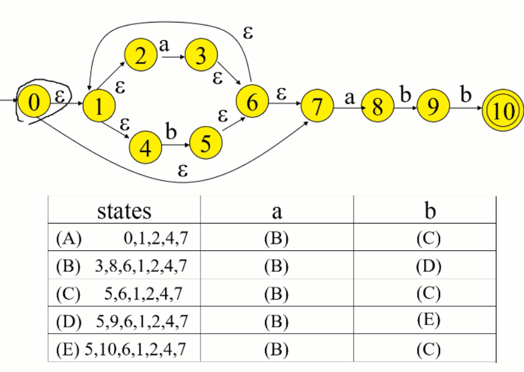
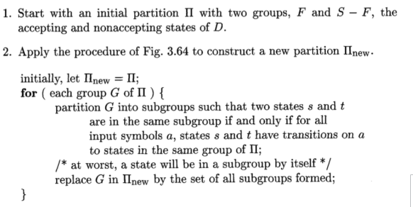
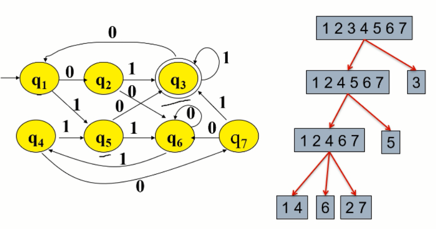

# Regex=NFA=DFA

[TOC]

DFA vs. NFA
- DFA has no $\epsilon$ edge
- NFA: one latter -> multi states

### construct DFA from NFA

$\epsilon-closure$ : move along any $\epsilon$ edge, until converging to a closure, such subset is a state in DFA.

### construct DFA directly from regex expression

*Proof*:

Use mathematical induction to the number of operators in a regex expression.

regex expression $r$ with zero operator: $r=\epsilon$, $r=\empty$, $r=a \in \Sigma$

regex expression r with more than one operators could be separated into interior sub-expressions: or-expression $r= r_1 | r_2$ , concatenating-expression $r=r_1r_2$ and repeating-expression $r=r_1^*$.

QOE.

*features*:

1. the number of state in DFA $\leq$ 2 * the number of operators in regex expression

2. only have one starting state and one ending state

3. except for the ending state, each state either has an non-$\epsilon$ out edge, or has at most two $\epsilon$ out edges.

### minimizing the numbers of states in DFA

Time complexity: $O(n\log n)$, where $n$ is the number of states in DFA.

