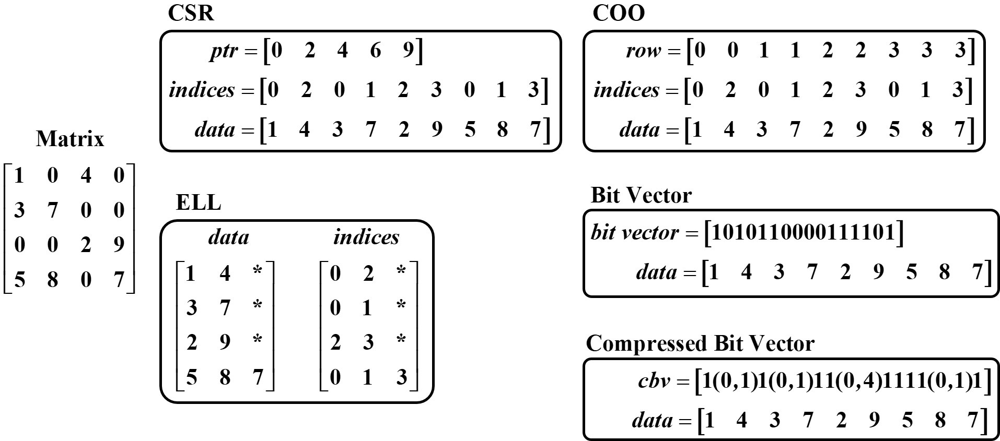
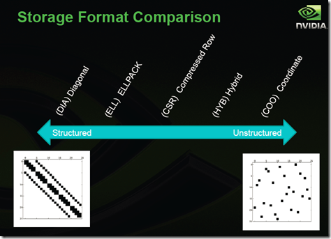
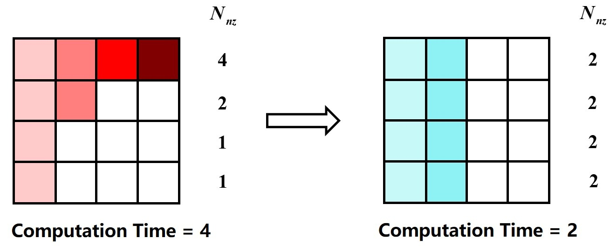

# Sparse Matrix computation

[TOC]

## Sparse Storage Format

| Paper                | Tag   | Abstract                                                     |
| -------------------- | ----- | ------------------------------------------------------------ |
| F-COO[^1]            |       | sparse tensor storage format, similar to the co-ordinate format and used it for GPUs |
| CSF[^2] & Hi-COO[^3] |       | sparse tensor storage formats that are are based on CSR and COO, respectively |
| OuterSPACE[^4]       |       | uses a variant of CSR and CSC formats called CR and CC for SpGEMM |
| Cambricon-X[^5]      | `CNN` | modification of CSR format where the non-zeros are compressed and stored in contiguous memory and index vectors are used to decode the row and column indices |
| EIE[^6]              | `CNN` | s a variant of CSC storage format where instead of storing the row indices they store the number of zeros before a non-zero element. |

### 存储格式压缩

参考见[此](https://www.cnblogs.com/xbinworld/p/4273506.html).

传统的存储格式有

- COO
- CSR, CSC
- ELL
- D(Diagonal)IA: 对对角阵效率比较高
- Hybrid (HYB) ELL + COO
- Bit Vector

  

选择稀疏矩阵存储格式的一些经验：

1. DIA和ELL格式在进行SpMV时效率最高，所以它们是应用迭代法(如共轭梯度法)解稀疏线性系统最快的格式
2. COO和CSR格式比起DIA和ELL来，更加灵活，易于操作
3. ELL的优点是快速，而COO优点是灵活，二者结合后的HYB格式是一种不错的稀疏矩阵表示格式
4. 根据[Nathan Bell的工作](http://www.bu.edu/pasi/files/2011/01/NathanBell1-10-1000.pdf)，CSR格式在存储稀疏矩阵时非零元素平均使用的字节数(Bytes per Nonzero Entry)最为稳定（float类型约为8.5，double类型约为12.5），而DIA格式存储数据的非零元素平均使用的字节数与矩阵类型有较大关系，适合于Structured Mesh结构的稀疏矩阵（float类型约为4.05，double类型约为8.10），对于Unstructured Mesh以及Random Matrix,DIA格式使用的字节数是CSR格式的十几倍
5. 从我使用过的一些线性代数计算库来说，COO格式常用于从文件中进行稀疏矩阵的读写，如matrix market即采用COO格式，而CSR格式常用于读入数据后进行稀疏矩阵计算

  

### 索引压缩

索引是整数，因此可以对标志非零元位置的索引进行压缩，使得索引的位宽减少. 几个典型的方法是:

- Elias Gamma Coding

- Huffman Coding(哈夫曼编码)

- Run-Length Coding(游程编码)

其中游程编码适合对有连续取相同值的索引进行压缩. 哈夫曼编码属于熵编码，因此有很高的压缩率，但是熵编码不等长的特点，解码过程需要依赖于已经解码的元素，并行度和抗噪能力都不高.

#### 值压缩

在现在十分流行的深度学习算法中，神经元之间的连接权重具有很强的抗噪声特性。这使得在不影响神经网络精度的情况下，可以对权重矩阵进行取值近似，把矩阵元素的取值范围约束成十几种甚至几种，进而再做压缩存储，可以大大减小神经网络的参数存储需求.

## 优化方向: 负载均衡问题

我们也看到了前面的优化过程导致每个矩阵块的运算量并不能保证完全一致，这就造成了最终的SpMV处理时间是由计算最慢的计算单元所决定的。在负载极度不平衡的情况下，负载最重的单元会严重拖慢整个计算过程，所以负载平衡是不能忽视的问题。

  

针对这个问题，按照处理方式，大概可以分成两种：

- 动态负载调整法
- 静态负载调整法

　动态调整法需要先对矩阵做一次运算，然后根据矩阵运算过程中的负载统计在接下来的计算中对负载进行动态分配。而静态平衡法，则是在计算前对矩阵非零元进行分析，将尽可能数量差不多的非零元送到一个处理单元进行计算，依次缓解负载不平衡的问题。

*[Efficient and Effective Sparse LSTM on FPGA with Bank-Balanced Sparsity](), FPGA 2019* 这篇论文同时对神经网络的剪枝和在硬件上的负载均衡进行了考虑.

## Software Frameworks

| Paper                                    | Tag  | Abstract                                                     |
| ---------------------------------------- | ---- | ------------------------------------------------------------ |
| TACO[^7]                                 |      | a language and compiler framework to generate high-performance code for sparse matrix and tensor kernels for CPUs.  |
| SPLATT[^9]                               |      | a C library implementing Sp<u>MTTKRP(Matricized tensor times Khatri-Rao product)</u> and Sp<u>TTMc(tensor times matrix)</u> with shared memory parallelization. |
| Kjolstad et al.[^8]                      |      | introduced workspace optimizations in TACO[^7] to implement operand factoring optimizations in tensor kernels. |
| Bhaskaran et al. [^10]                   |      | proposed various techniques to reduce memory usage and execution time for sparse tensor factorization algorithms. |
| Ballard et al.[^11] and Choi et al.[^12] |      | cproposed methods to perform DMTTKRP and DTTMc on CPU and GPU |
|                                          |      |                                                              |
|                                          |      |                                                              |
|                                          |      |                                                              |

## Hardware Accelerators

| Paper             | Tag  | Abstract                                                     |
| ----------------- | ---- | ------------------------------------------------------------ |
| T2S-Tensor[^13]   |      | a language and compilation framework that generate high performance hardware for dense tensor computations such as GEMM, DMTTKRP and DTTMc. |
| Zhang et al.[^14] |      | a hardware accelerator for DTTMc.                            |
| ExTensor[^15]     |      | a hardware accelerator for sparse tensor algebra using the ideas of merge lattice proposed in TACO[^7] |
| Tensaurus[^16]    |      | a versatile accelerator for mixed sparse-dense tensor computations |
| SCNN[^17]         |      | a SpGEMM accelerator for CNNs which can exploit the sparsity in both weights and neurons |
| OuterSPACE[^18]   |      | an accelerator design for SpGEMM                             |
| EIE[^19]          |      | e <u>SpMSpV (sparse matrix sparse vector multiplication)</u> accelerator for fully connected layers in CNN show significant performance gains over CPU and GPU. |
| TPU[^20]          |      | implemented a 2-d systolic array for GEMM                    |

## Reference

- https://jackgittes.github.io/2017/08/23/matrix-multip-optimization/

[^1]:
