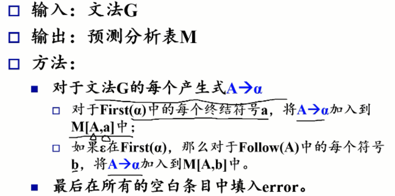
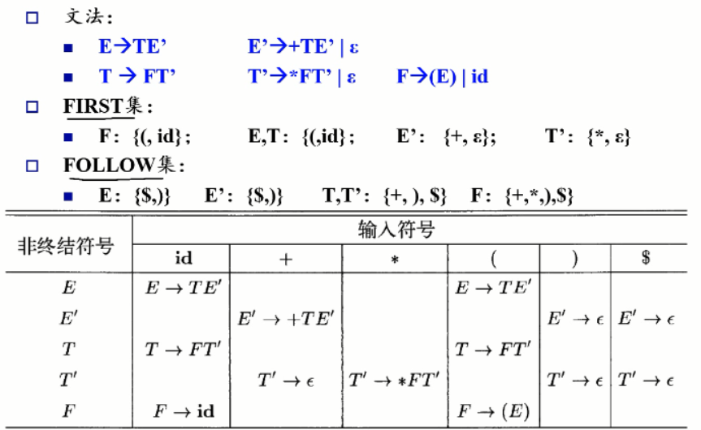
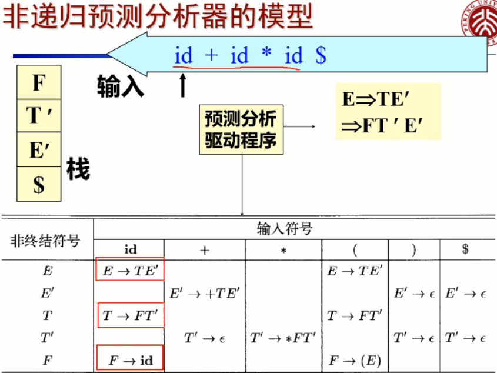
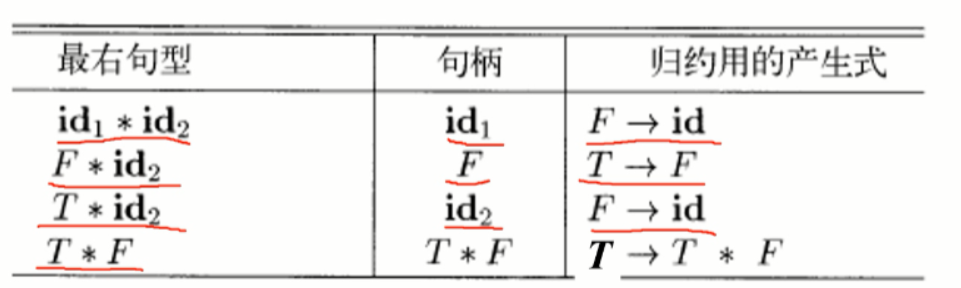
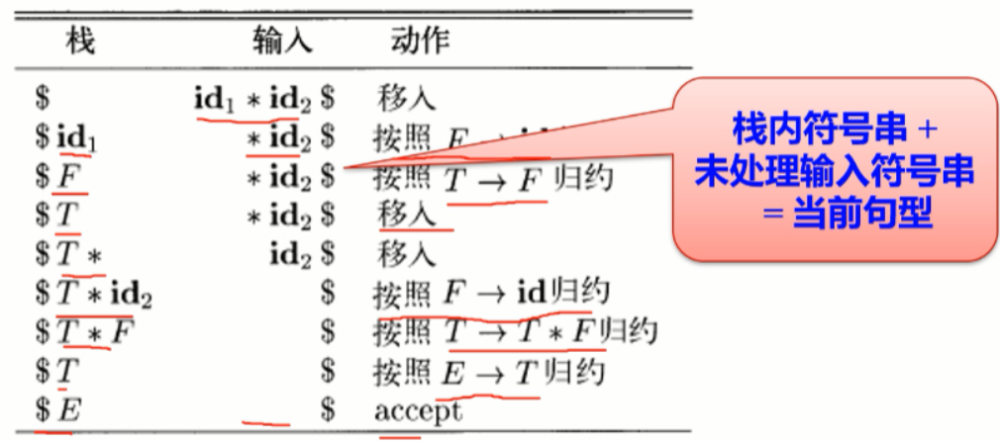
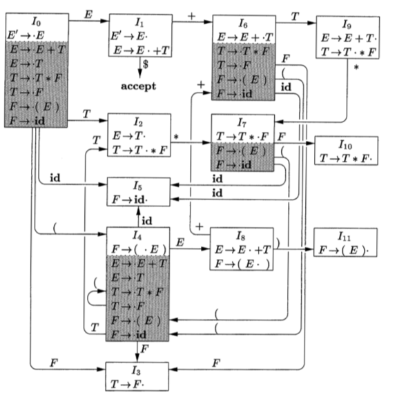
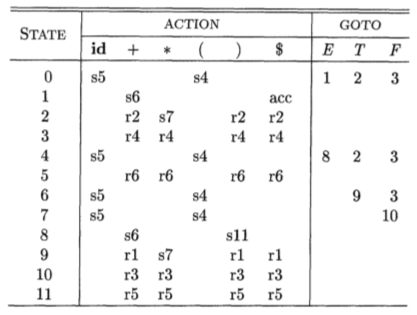

# Syntax Analysis

[TOC]

#### general types parsers for syntax

- universal(Cocke-Younger-Kasami, Earley's algorithm): inefficient
- top-down (implemented by hand, usually LL) 
- bottom-up 


#### syntax error

1. lexical: misspelling
2. syntactic: misplace; { }
3. semantic: type mismatch
4. logical: == or =


#### recovery strategies

| strategies        | memo                                                         |
| ----------------- | ------------------------------------------------------------ |
| Panic-mode        | discard input until synchronizing token (usually ; { } ( ) ) is found. |
| Phrase-level      | perform local correction                                     |
| Error productions | Augment the grammar. Use production to detects               |
| Global correction | Make as few changes as possible. Often too costly to implement |


#### derivation

grammar $G$ -> sentential form -> sentence(no non-terminals)

language $L(G)$: the set consisting of all the sentences by a grammar


#### regular grammar

left regular grammar: only in form

```
A -> a
A -> Ba
```

right regular grammar: only in form

```
A -> a
A -> aB
```

leftmost derivation vs. rightmost derivation

ambiguous: multiple leftmost/rightmost derivation


#### context-free grammar(CFG)

definition: The left hand side of every generation expression must be a single non-terminal symbol.

tips:
- For any context-free grammar there is a parser that takes at most $O(n^3)$ time to parse a string of $n$ terminals. 
- the expressing ability of *CFG* is strong than *regex=DFA=NFA*. 
  - eg. CFG $S \rightarrow aSb | ab$ , its $L(G)=\{a^nb^n|n>0\}$ could not be expressed by regex expression.
- There is no a algorithm that can justify whether a CFG is ambiguous. However, we could give *<u>sufficient conditions</u>* to justify whether a CFG is ambiguous.


#### non-CFG


CFG不能检查标识符的声明是否先于引用, 也不能检查形参和实参个数是否一致(参数个数检查一般放在语义分析阶段)


### Eliminating ambiguity

#### if-else

“else” matches with closest previous unmatched "then"


#### strings with the same numbers of ‘a’ & ‘b’

(ambiguous)$S \rightarrow aSb \vert bSa \vert SS \vert ab \vert ba$

=>

S -> TS | T

T -> aB | bA

A -> a | bAA

B -> b | aBB

#### left factoring

##### direct left recursion

A -> Ab | Ac | d

replace the longest common prefix a with:

A -> dA’

A’ -> bA’ | cA’ | $\epsilon$

##### indirect left recursion

S -> Aa | b

A -> Sd | $\epsilon$

transfer to direct left recursion

S -> Aa | b

A -> Aad | bd | $\epsilon$


##### left factoring

A -> a b | a c | d

Replace the longest common prefix a with:

A -> a A' | d

A' -> b | c

##### first follow


if A can be the rightmost, $ in FOLLOW(A)

if A =*> e, then e in FIRST(A)


how to find Follow(A)?

1. -> … A B … : add Frist(B) except for $\epsilon$ 

2. S -> … A B1 B2 … Bk && all Bi have $\epsilon$ in their Frist set: add Follow(S)


### LL(1)

Definition: 

for any A -> a | b

1. FIRST(a) and FIRST(b) are disjointed
2. if FIRST(b) contains e, then FIRST(A) and FELLOW(A) is disjointed


Remark:

First L: from left to right

Second L: leftmost derivation

1: only look ahead *one* step


Construction of predictive parsing table

Non-recursive parsing






implement #1 of LL(1): **recursive descent subroutine**

eg. parsing suffix expression


implement #2 of LL(1): **table-driving non-recursive parsing**



non-LL(1) grammar:

- ambiguous grammar
-  left-recursive grammar: eg. E->E + T | T

  

### LR(0)

| bottom-up | right derivation |
| --------- | ---------------- |
| up-bottom | left derivation  |

L: left-to-right

R: right-most

0/1: 1: only look ahead *zero*/*one* step


handle:



shift-reduce parsing(got right-most derivation)



- Shift as long as you can reduce

- handle is always at the top of the stack

  



item: production with dot

a box: closure

shadowed boxes: non-kernel items

| non-kernel items                               | kernel items                                                 |
| ---------------------------------------------- | ------------------------------------------------------------ |
| with dot at the  left end, except for S' -> .S | initial state S'  -> .S or that have the dot somewhere other than at the beginning |




r: reduce

s: shift

