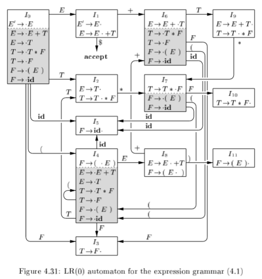
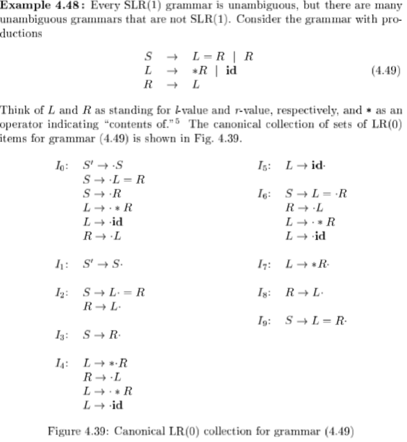

---

attachments: [Clipboard_2020-03-23-22-09-27.png]
tags: [Notebooks/Compiler]
title: Syntax Analysis
created: '2020-02-18T16:10:46.730Z'
modified: '2020-04-03T05:28:32.352Z'
---

# Syntax Analysis

[TOC]

#### general types parsers for syntax

- universal(Cocke-Younger-Kasami, Earley's algorithm): inefficient
- top-down (implemented by hand, usually LL) 
- bottom-up 


#### syntax error

1. lexical: misspelling
2. syntactic: misplace; { }
3. semantic: type mismatch
4. logical: == or =


#### recovery strategies

| strategies        | memo                                                         |
| ----------------- | ------------------------------------------------------------ |
| Panic-mode        | discard input until synchronizing token (usually ; { } ( ) ) is found. |
| Phrase-level      | perform local correction                                     |
| Error productions | Augment the grammar. Use production to detects               |
| Global correction | Make as few changes as possible. Often too costly to implement |


#### derivation

grammar $G$ -> sentential form -> sentence(no non-terminals)

language $L(G)$: the set consisting of all the sentences by a grammar


#### regular grammar

left regular grammar: only in form

```
A -> a
A -> Ba
```

right regular grammar: only in form

```
A -> a
A -> aB
```

leftmost derivation vs. rightmost derivation

ambiguous: multiple leftmost/rightmost derivation


#### context-free grammar(CFG)

definition: The left hand side of every generation expression must be a single non-terminal symbol.

tips:
- For any context-free grammar there is a parser that takes at most $O(n^3)$ time to parse a string of $n$ terminals. 
- the expressing ability of *CFG* is strong than *regex=DFA=NFA*. 
  - eg. CFG $S \rightarrow aSb | ab$ , its $L(G)=\{a^nb^n|n>0\}$ could not be expressed by regex expression.
- There is no a algorithm that can justify whether a CFG is ambiguous. However, we could give *<u>sufficient conditions</u>* to justify whether a CFG is ambiguous.


#### non-CFG


CFG不能检查标识符的声明是否先于引用, 也不能检查形参和实参个数是否一致(参数个数检查一般放在语义分析阶段)


### Eliminating ambiguity

#### if-else

“else” matches with closest previous unmatched "then"


#### strings with the same numbers of ‘a’ & ‘b’

(ambiguous)$S \rightarrow aSb \vert bSa \vert SS \vert ab \vert ba$

=>

S -> TS | T

T -> aB | bA

A -> a | bAA

B -> b | aBB

#### left factoring

##### direct left recursion

A -> Ab | Ac | d

replace the longest common prefix a with:

A -> dA’

A’ -> bA’ | cA’ | $\epsilon$

##### indirect left recursion

S -> Aa | b

A -> Sd | $\epsilon$

transfer to direct left recursion

S -> Aa | b

A -> Aad | bd | $\epsilon$


##### left factoring

A -> a b | a c | d

Replace the longest common prefix a with:

A -> a A' | d

A' -> b | c

##### first follow


if A can be the rightmost, $ in FOLLOW(A)

if A =*> e, then e in FIRST(A)


how to find Follow(A)?

1. -> … A B … : add Frist(B) except for $\epsilon$ 

2. S -> … A B1 B2 … Bk && all Bi have $\epsilon$ in their Frist set: add Follow(S)


### LL(1)

Definition: 

for any A -> a | b

1. FIRST(a) and FIRST(b) are disjointed
2. if FIRST(b) contains e, then FIRST(A) and FELLOW(A) is disjointed


Remark:

First L: from left to right

Second L: leftmost derivation

1: only look ahead *one* step


Construction of predictive parsing table

Non-recursive parsing


implement #1 of LL(1): **recursive descent subroutine**

eg. parsing suffix expression


implement #2 of LL(1): **table-driving non-recursive parsing**


non-LL(1) grammar:

- ambiguous grammar
-  left-recursive grammar: eg. E->E + T | T

  

### LR(0)

| bottom-up        | up-bottom       |
| ---------------- | --------------- |
| right derivation | left derivation |

L: left-to-right

R: right-most

0/1: only look ahead *zero*/*one* step

LR(0) < SLR < LALR < LR(1)

#### What is a handle?

Informally, a “handle” is a substring that matches the body of a production, and whose reduction represents one step along <u>the reverse of a rightmost derivation</u>.


#### What is Shift-Reduce Parsing?


*Note: There are context-free grammars for which shift-reduce parsing cannot be used for the conflicts during shift-reduce parsing.*

#### Closure of Item Sets


#### GOTO Function


#### LR(0) Automation

item: production with dot

a box: closure

shadowed boxes: non-kernel items

| non-kernel items                              | kernel items                                                 |
| --------------------------------------------- | ------------------------------------------------------------ |
| with dot at the left end, except for S' -> .S | initial state S'  -> .S or that have the dot somewhere other than at the beginning |



*Note: A automation is not enough to determine reduce/shift behavior.*

#### LR Parsing Table

#### SLR(Simple LR)-Parsing Table


improved from LR(0) by using <u>FOLLOW</u> to determine shift or reduce: If the new terminal is in the FOLLOW set of the top state of the stack, that reduce, otherwise shift.

> How to judge if a grammar is SLR(1)?
>
> In any items set, every two productions have disjointed FOLLOW set. 


#### LR Parsing Algorithm


### Viable Prefixes & Valid Items

The prefixes of right sentential forms that can appear on the stack of a shift-reduce parser are called **viable prefixes**.

**An item is valid** for a viable prefix if the production of that item is used to generate the handle, and the viable prefix includes all those symbols to the left of the dot, but not those below.


### Canonical LR(CLR)=LR(1)

non-SLR grammar examples: Example 4.48(left-value & right-value)

ACTION(I2, =) reduce-shift conflict


#### Constructing LR(1) Sets of Items


#### LR(1) Automation


#### LR(1) Parsing Table


### LALR(lookahead-LR)

address the problem that SLR and LR are space consuming.

**core**: states that are almost the same except for the searching strings.

replace all states having the same core with their union **if no conflicts arise**

#### Another Efficient Construction of LALR Parsing Tables

only look at kernel item(initial state S'  -> .S or that have the dot somewhere other than at the beginning)

​	

represent LR(0) items:


propagation & spontaneous generation of lookaheads:


INIT: spontaneously generated

PASS: propagated

