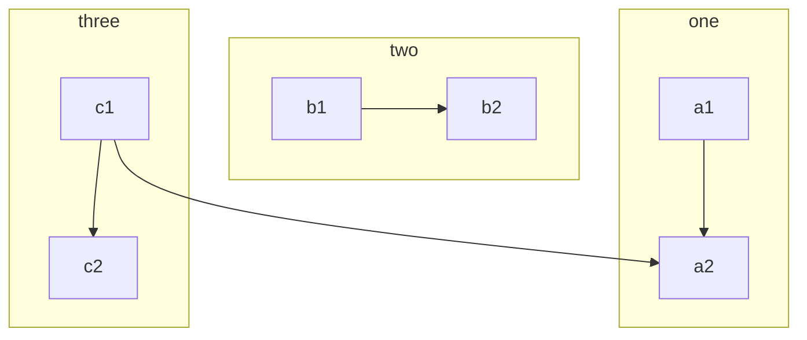
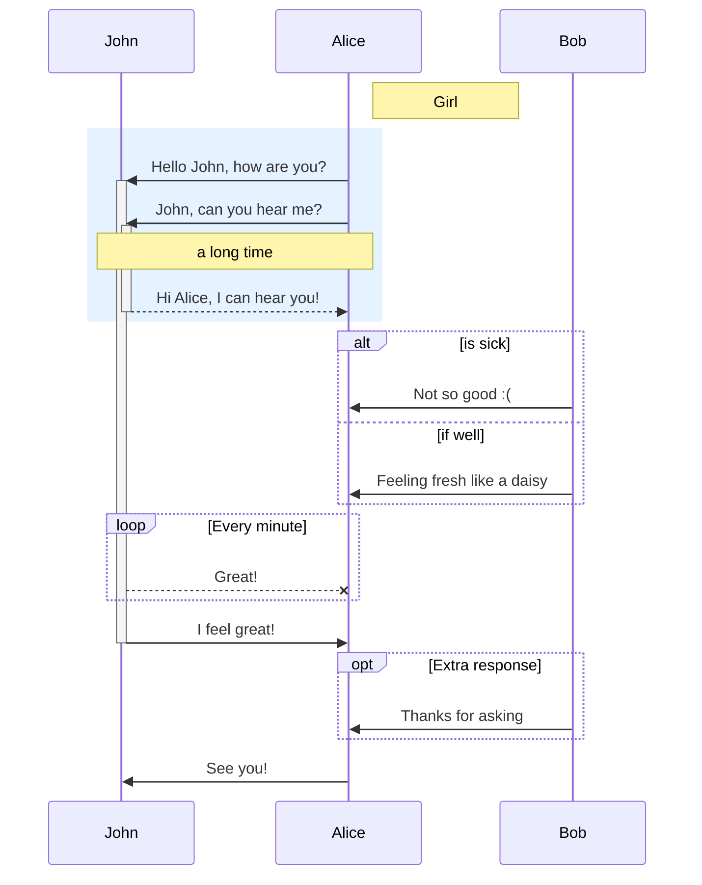
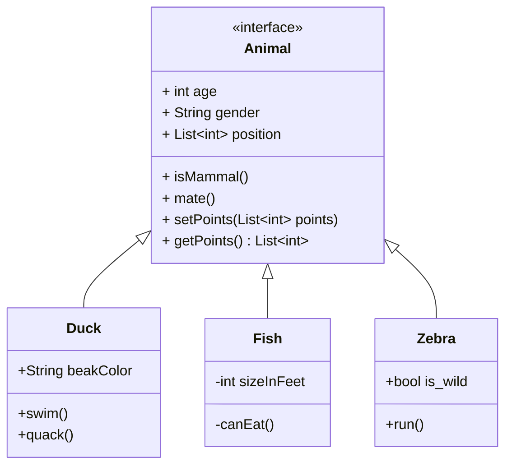
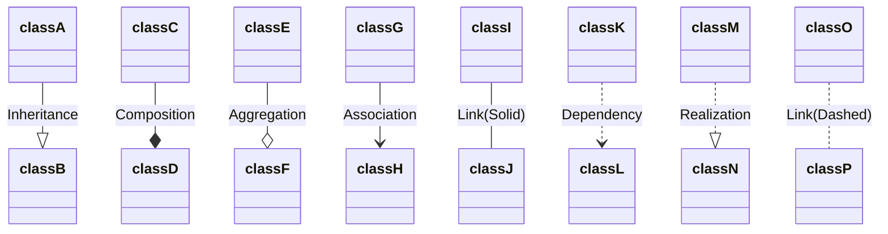
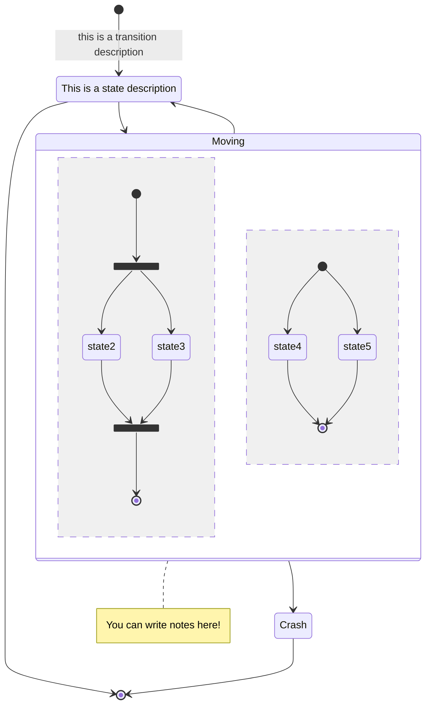
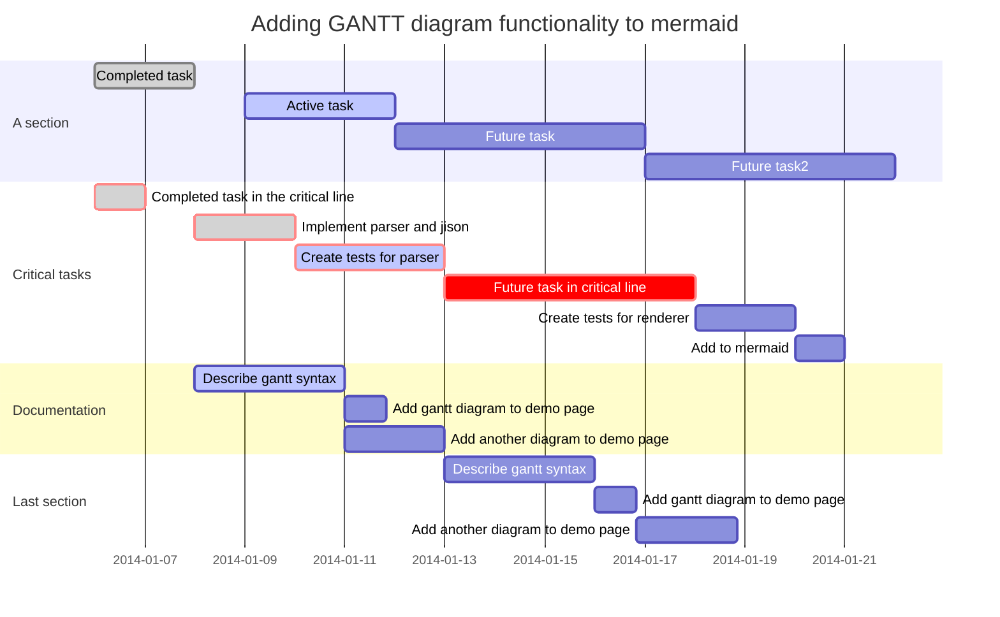
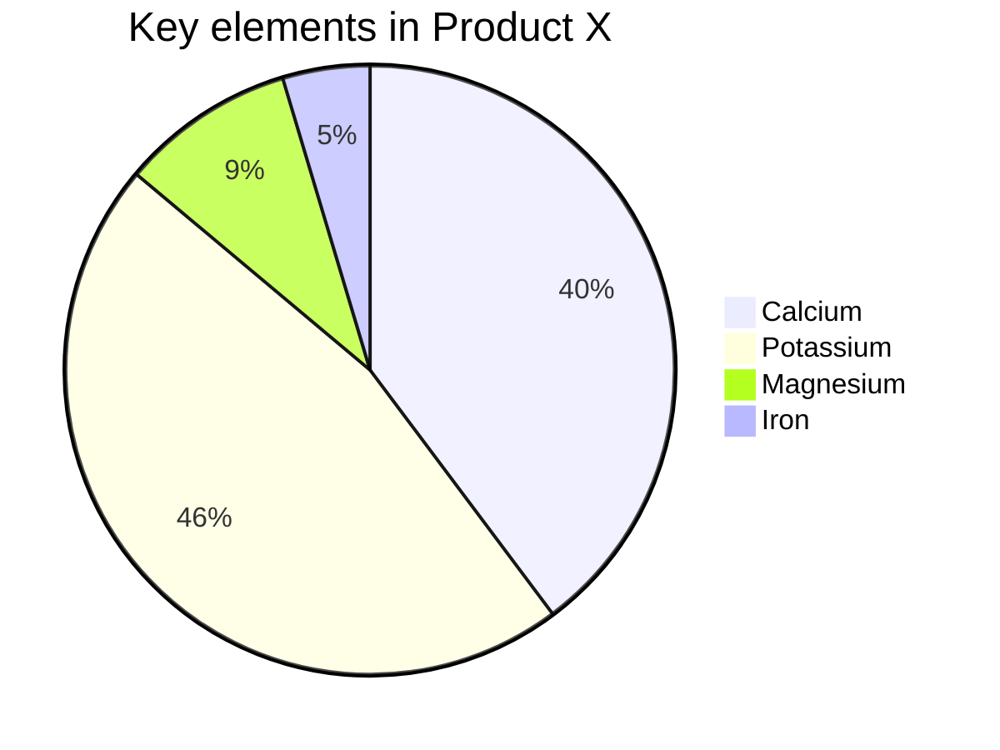

# mermaid in 30 Minutes

[TOC]

## Flowchart



leverage <u>EntityCode</u> for special characters.

## Sequence Diagrams



There are six types of arrows currently supported in sequence Diagram:

| Type | Description                                 |
| ---- | ------------------------------------------- |
| ->   | Solid line without arrow                    |
| -->  | Dotted line without arrow                   |
| ->>  | Solid line with arrowhead                   |
| -->> | Dotted line with arrowhead                  |
| -x   | Solid line with a cross at the end (async)  |
| --x  | Dotted line with a cross at the end (async) |

## Class diagrams



[visibility]

- `+` Public
- `-` Private
- `#` Protected
- `~` Package/Internal
- `*` Abstract e.g.: `someAbstractMethod()*`
- `$` Static e.g.: `someStaticMethod()$`

[relationship]

| Type  | Description   |
| ----- | ------------- |
| <\|-- | Inheritance   |
| *--   | Composition   |
| o--   | Aggregation   |
| -->   | Association   |
| --    | Link (Solid)  |
| ..>   | Dependency    |
| ..\|> | Realization   |
| ..    | Link (Dashed) |



## State Diagrams



## Gantt



### Time Description

```
YYYY    2014    4 digit year
YY    14    2 digit year
Q    1..4    Quarter of year. Sets month to first month in quarter.
M MM    1..12    Month number
MMM MMMM    January..Dec    Month name in locale set by moment.locale()
D DD    1..31    Day of month
Do    1st..31st    Day of month with ordinal
DDD DDDD    1..365    Day of year
X    1410715640.579    Unix timestamp
x    1410715640579    Unix ms timestamp

Input    Example    Description
H HH    0..23    24 hour time
h hh    1..12    12 hour time used with a A.
a A    am pm    Post or ante meridiem
m mm    0..59    Minutes
s ss    0..59    Seconds
S    0..9    Tenths of a second
SS    0..99    Hundreds of a second
SSS    0..999    Thousandths of a second
Z ZZ    +12:00    Offset from UTC as +-HH:mm, +-HHmm, or Z
```

More info in: http://momentjs.com/docs/#/parsing/string-format/

### Scale

```
%a - abbreviated weekday name.
%A - full weekday name.
%b - abbreviated month name.
%B - full month name.
%c - date and time, as "%a %b %e %H:%M:%S %Y".
%d - zero-padded day of the month as a decimal number [01,31].
%e - space-padded day of the month as a decimal number [ 1,31]; equivalent to %_d.
%H - hour (24-hour clock) as a decimal number [00,23].
%I - hour (12-hour clock) as a decimal number [01,12].
%j - day of the year as a decimal number [001,366].
%m - month as a decimal number [01,12].
%M - minute as a decimal number [00,59].
%L - milliseconds as a decimal number [000, 999].
%p - either AM or PM.
%S - second as a decimal number [00,61].
%U - week number of the year (Sunday as the first day of the week) as a decimal number [00,53].
%w - weekday as a decimal number [0(Sunday),6].
%W - week number of the year (Monday as the first day of the week) as a decimal number [00,53].
%x - date, as "%m/%d/%Y".
%X - time, as "%H:%M:%S".
%y - year without century as a decimal number [00,99].
%Y - year with century as a decimal number.
%Z - time zone offset, such as "-0700".
%% - a literal "%" character.
```

More info in: https://github.com/mbostock/d3/wiki/Time-Formatting

## Pie Chart




# Resources

- https://mermaidjs.github.io/#/
- https://entitycode.com/
- https://support.typora.io/Draw-Diagrams-With-Markdown/

