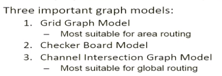
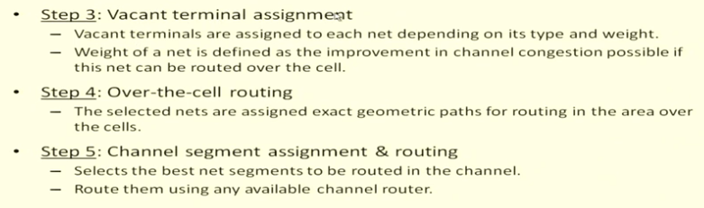

# routing

## Resources

- https://www.youtube.com/channel/UCTSQnoUHhScO2ceUfqRHaKw/videos

## Overview

There are three different types of routing. Given a set of blocks placed on a layout surface and defined pin locations

- *grid routing*: given a set of obstacles and a set of pin to connect, determine a solution to interconnect the pins on a single layer

- *global routing*: determine the approximate regions through which each interconnection net should pass

- *detailed routing*: For each routing region, complete the interconnection be assigning horizonal and vertical metal line segments on the layout surface.

  

  
  
  > Note:  With the development of modern technology, nowadays we use *channel-less routing* in industry, which means all the routing wires are on multiply layers apart from the blocks.

## Grid Routing

### Maze Running Algorithm

The entire routing surface is represented by a 2D-array of grid cells.

#### Lee’s Algorithm

If a path exists between a pair of points S and T, it is definitely found.

Try to intuitively minimize the number of bends.

- strategy to reduce memory usage:

(red 0)(blue 0)(red 1)(blue 1)(red 0)……

- connecting multi-point nets

  

#### Hadlock’s Algorithm

The cells with least detour numbers will be expanded with high priority.

Any cell with the same detour number can be expanded simultaneously.

### Linear search Algorithm

#### Mikami-Tabuchi’s Algorithm

- Step i of iteration
  - If there is no intersection, pick up trial lines of level i-1, one at a time.
    - Along the trial line, all its grid points are traced
    - starting from these grid points, new trial line of level i are generated perpendicular to the trial line of level i-1

#### Hightower’s Algorithm

### Steiner Tree Based Algorithm

## Global Routing

 ### Design Style Specific Issues

- <u>Standard Cell</u>. (Terminal: feed through)

  
  
- <u>Gate Array</u>

  

### Graph Models used in Global Routing

- Checker Board Model: Not all the blockshave the same size. The edge capacities are computed based on the actual area available for routing on the cell boundary.

- Channel Intersection Graph Model(channel->edge, intersection -> vertices)

  

- Extended Channel Intersection Graph: also includes the pins as vertices

  

### Relation with Detailed Routing

### When floor-plain is Given

- The **dual graph** of floor-plan is used for global routing.

### When Placement is Given

The routing region is partitioned into simpler regions.

### Global Routing Algorithm: Sequential Approaches

*Rip up and reroute heuristic in case of conflict.*

### Global Routing Algorithm: Integer Linear Programming Approach(only for small nets)

constraints:

- one net, many candidate solutions(mutual exclusion)
- capacity of each routing region must not be exceeded.
- if each solution is assigned a cost, a possible objective function to minimize could be defined.

### Global Routing Algorithm: Hierarchical Approaches

- divide an conquer -> integer programming problem

- two categories: top-down & bottom-up

### Global Routing Algorithm: Performance Driven Routing

## Detailed Routing

- terminal: 

  - floating terminal: virtual terminal on the boundary of the routing sub-regions. 
  - via connection: metal connection between different layers
  - channel & switchboxes

  

### Order of Routing Regions

There are differences between slicing placement & non-slicing placement. In this case, some the routing regions are to be considered as switchboxes.

### Models for Multi-layer Routing

### Channel Routing

[Problem Statement]

#### Channel Constraints

- Horizontal Constraint Graph(HCG)
It is a graph where vertices represent nets, and edges represent horizontal constraints.

- Vertical Constraint Graph(VCG)

[category of two-layer channel routing algorithm]

- constraint graph based channel router

- Greedy Channel Router

-  Hierarchical Channel Router

  

  [category of three-layer channel routing algorithm]

  

  

####  Left-Edge Algorithm(LEA)

- terminal

  - dogleg

    

Extension to Left-Edge Algorithm: no cycle in VCG

#### Dogleg Router

*Note: Only use dogleg when there are three or more terminals.*

#### Net Merge Channel Router

 

In cases of multiple choices, merge the net-pair that minimizes the length of the longest path in VCG.

#### Greedy Channel Router

#### HVH(3-layer) from HV Solution

- terminal: track-ordering graph

Illustration:

- time -> chunk
- Leverage shortest-path algorithm to find the minimum cost of via connection

### Switchbox Routing

 

#### Switchbox Routing: BEAVER

###  Over-the-cell(OTC) Routing

- only for standard cell based design

